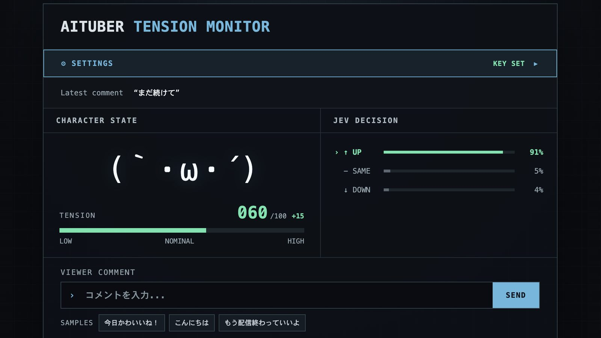

# Jev AITuber Tension Demo

English | [日本語](./README.ja.md)



A small demo that passes a viewer comment to [Jev](https://typesafe.ai/blog/introducing-system-one-models-and-jev) and asks whether the AITuber's tension goes up, stays the same, or goes down. The tension value and the character's kaomoji change according to the result.

Jev does not generate text. It returns which of your predefined options applies, with a probability for each option. This demo shows all three probabilities (`UP` / `SAME` / `DOWN`) on screen.

```text
Viewer comment → Jev → UP / SAME / DOWN → tension change → kaomoji change
```

## Getting started

Requires Node.js 20.19+ or 22.12+.

```bash
npm install
npm run dev
```

Open the URL printed in the terminal.

## Usage

1. Open `SETTINGS` and choose a `Provider`: the official [TypeSafe AI](https://typesafe.ai/) API (default) or [OpenRouter](https://openrouter.ai/).
2. Enter the API key for that provider. Changes are saved automatically. Keys are stored per provider, so switching does not erase them. TypeSafe AI keys are created at [console.typesafe.ai/keys](https://console.typesafe.ai/keys).
3. The default `Model ID` works as is (`jev-latest` on TypeSafe AI, `typesafe/jev-1.13` on OpenRouter).
4. Type a comment and press `SEND` (or hit Enter).

When the decision comes back, the three probabilities under `JEV DECISION` are updated, and the option with the highest probability changes the tension.

| Decision | Tension |
| --- | --- |
| UP | +15 |
| SAME | no change |
| DOWN | -15 |

Tension ranges from 0 to 100 and starts at 50. The kaomoji changes as follows.

| Tension | Kaomoji |
| --- | --- |
| 80–100 | `＼(^o^)／` |
| 60–79 | `(｀・ω・´)` |
| 40–59 | `(・ω・)` |
| 20–39 | `(´・ω・`)` |
| 0–19 | `(；ω；)` |

The last five decisions are listed at the bottom of the screen. Reloading the page resets the history and the tension.

## How Jev is called

The endpoint and the model name depend on the provider.

| Provider | Endpoint | Example model name |
| --- | --- | --- |
| TypeSafe AI | `POST https://api.typesafe.ai/v1/systemone` | `jev-latest` |
| OpenRouter | `POST https://openrouter.ai/api/alpha/decisions` | `typesafe/jev-1.13` |

On OpenRouter, Jev cannot be called through the Chat Completions API; the Decisions API (alpha) is used instead.

The request and response shapes are the same for both providers. The request carries a `state` (the material to judge) and typed `questions`.

```json
{
  "model": "jev-latest",
  "state": {
    "current_tension": 50,
    "viewer_comment": "You look great today!"
  },
  "questions": {
    "tension": {
      "type": "choice",
      "instructions": "...",
      "criteria": { "up": "...", "same": "...", "down": "..." }
    }
  }
}
```

The per-option probabilities are in `answers.tension.probabilities` of the response.

```json
{
  "answers": {
    "tension": {
      "type": "choice",
      "choice": "up",
      "confidence": 0.88,
      "probabilities": { "up": 0.91, "same": 0.07, "down": 0.02 }
    }
  }
}
```

Inside the app, this is converted to the following shape.

```ts
type JevDecision = { up: number; same: number; down: number }
```

`probabilities` is optional in the API schema. When it is missing, the option named in `choice` is treated as 1 and the others as 0. If neither can be read, the app reports an error and leaves the tension unchanged.

Provider differences (URL, model names, extra headers) are defined in `src/lib/providers.ts`, and the request and conversion logic lives in `src/lib/jev.ts`. The UI only uses `judgeTension()` and `JevDecision`.

### TypeSafe AI is called through the dev server

As of September 2026, calling `https://api.typesafe.ai` directly from a browser fails: the preflight request is rejected with `Disallowed CORS origin`, including from `localhost`. The TypeSafe AI API was released only recently and its documentation does not mention CORS yet, so this may change.

For that reason, the Vite dev server in this demo forwards requests for `/api/typesafe` to `https://api.typesafe.ai` (see `vite.config.ts`). TypeSafe AI works only while the app runs under `npm run dev` or `npm run preview`. If you put the built `dist` on static hosting, only OpenRouter works.

If direct browser calls become possible, change the URL in `src/lib/providers.ts` to `https://api.typesafe.ai/v1/systemone` and remove the proxy from `vite.config.ts`; the dev server is then no longer needed for TypeSafe AI.

## API key handling

API keys are stored in the browser's localStorage. They are sent to TypeSafe AI through your local dev server, and directly from the browser to OpenRouter.

This approach is meant for a demo running on your own machine. In a public web service it would hand your key to every visitor's browser. For a public deployment, keep the key on a server and call the API through it.

## Development

```bash
npm run lint
npm run build
```

Built with Vite, React, and TypeScript.

## License

[MIT](./LICENSE)
